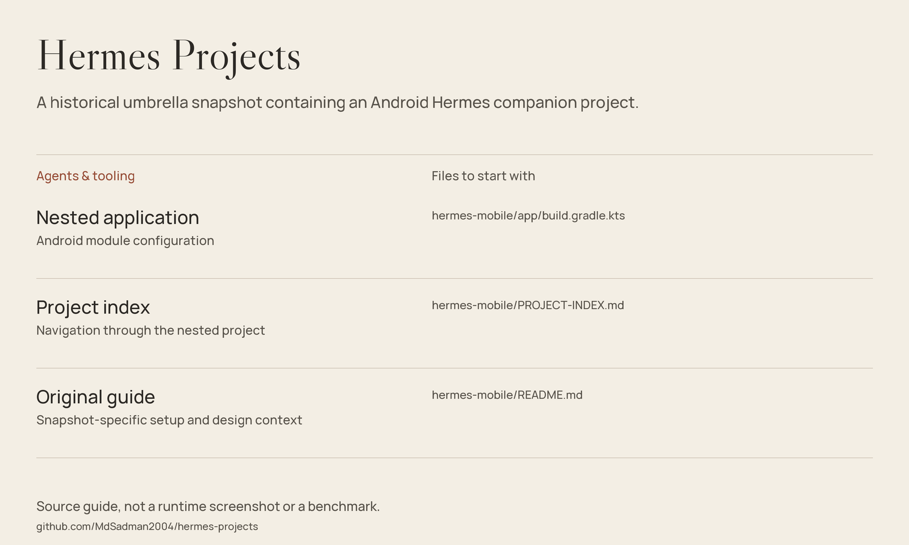

# Hermes Projects

A historical umbrella snapshot containing an Android Hermes companion project.



*Source guide drawn from the files in this repository; not a runtime screenshot or a fresh benchmark.*

[Inspect the snapshot](#inspect-the-snapshot) · [Source guide](#source-guide) · [Scope & limitations](#scope--limitations)

## Repository role

This umbrella repository contains a nested `hermes-mobile/` project: Kotlin / Compose application source, desktop-side scripts, build notes and specifications.

For the independently maintained application, start with **[MdSadman2004/hermes-mobile](https://github.com/MdSadman2004/hermes-mobile)**. This repository remains useful for inspecting the captured project state; it is not silently deleted or merged by this documentation refresh.

## Inspect the snapshot

```bash
git clone https://github.com/MdSadman2004/hermes-projects.git
cd hermes-projects/hermes-mobile
```

Read the [nested README](hermes-mobile/README.md) and [project index](hermes-mobile/PROJECT-INDEX.md) before building. The Android project starts inside `hermes-mobile`, not the repository root. Use JDK 17 and an Android SDK matching the nested module configuration.

## Build context

The Gradle launch scripts are included in the nested folder. Check that the wrapper JAR is present before relying on `./gradlew`; otherwise use a compatible locally installed Gradle distribution. The phone client also requires a separately running, compatible desktop Hermes service.

## Source guide

| Component | File | Purpose |
| :-- | :-- | :-- |
| Nested application | [hermes-mobile/app/build.gradle.kts](hermes-mobile/app/build.gradle.kts) | Android module configuration |
| Project index | [hermes-mobile/PROJECT-INDEX.md](hermes-mobile/PROJECT-INDEX.md) | Navigation through the nested project |
| Original guide | [hermes-mobile/README.md](hermes-mobile/README.md) | Snapshot-specific setup and design context |

## Scope & limitations

This is a snapshot, not a promise that it matches the standalone repository or a current Hermes release. Legacy URLs and machine-specific paths may appear in nested documentation. No fresh build, pairing session or device test was performed by this presentation update.

## Reuse & attribution

No standalone repository-wide license file is included in this checkout. Public source access is not a blanket license grant; check provenance and permissions before redistribution.
