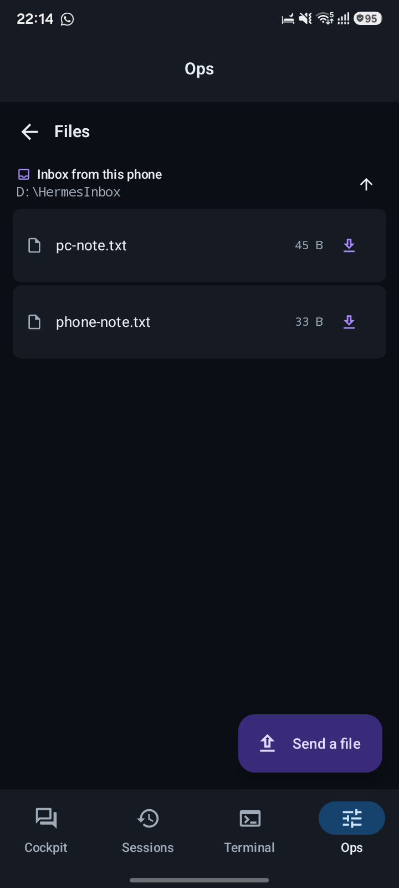
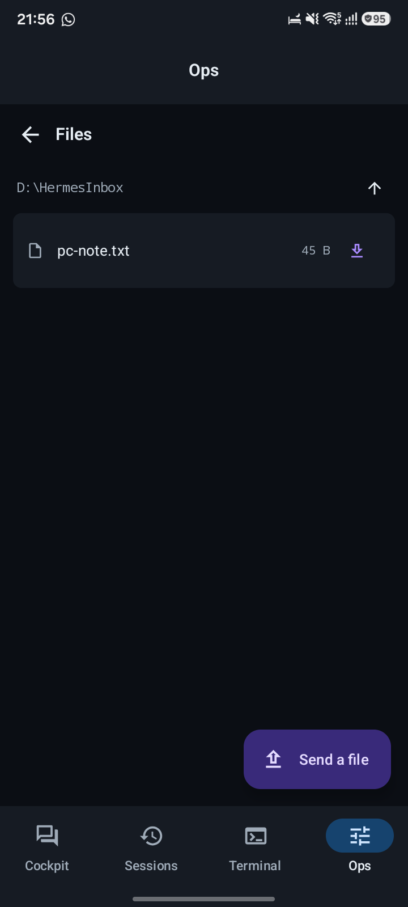
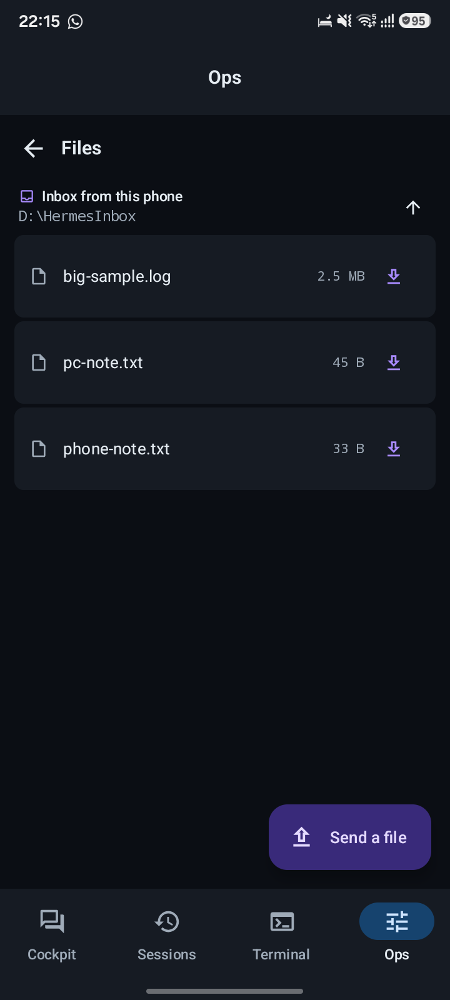
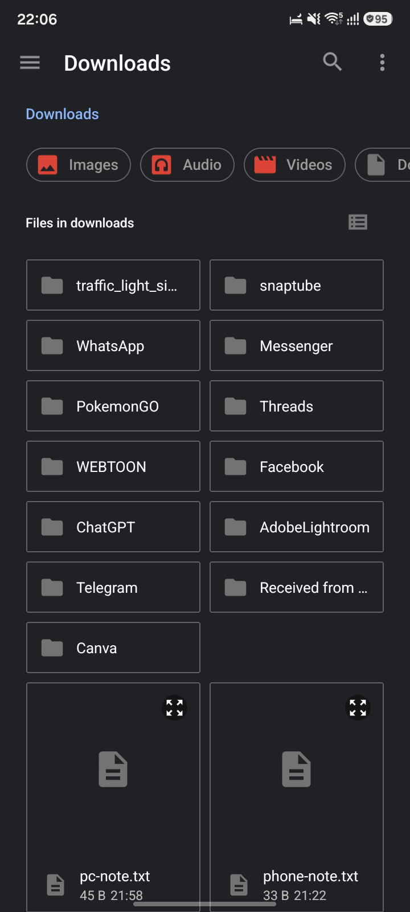
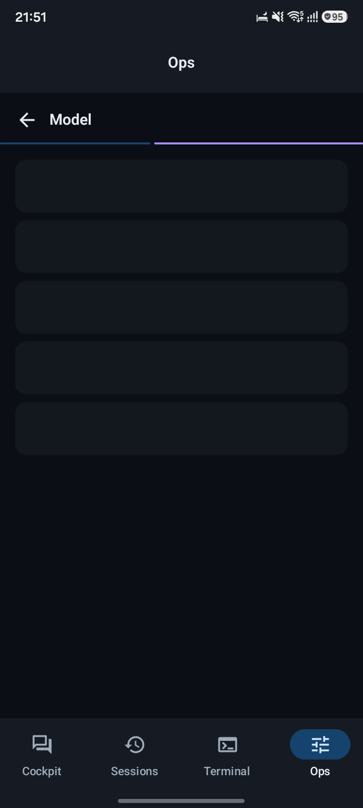
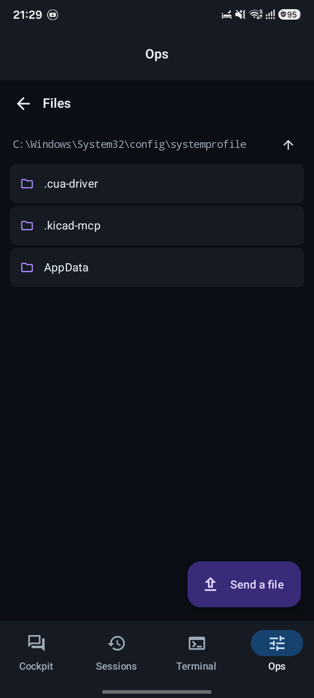
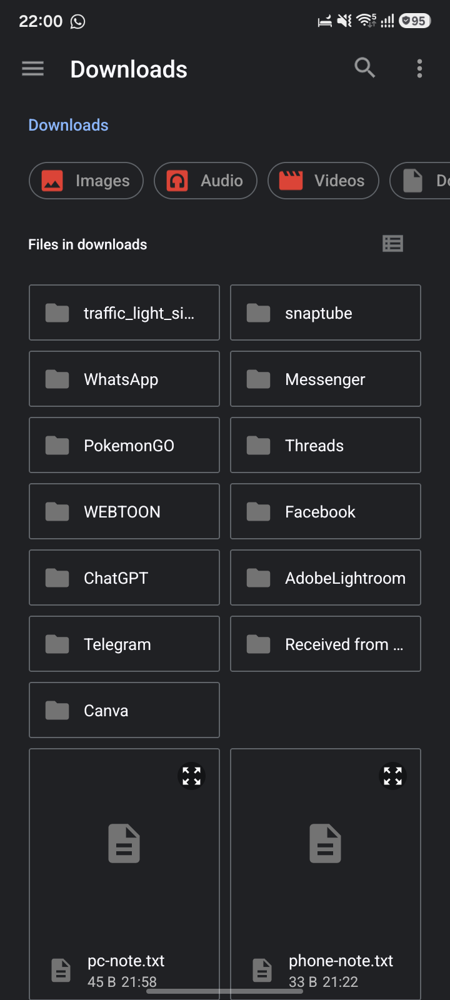

# Hermes Mobile

<p align="center">
  
</p>

**Hermes Mobile** is the Android companion to [Hermes Agent](https://hermes-agent.nousresearch.com) — a private, local-first control plane that lets your phone talk to your PC over your home Wi‑Fi. No VPN. No cloud. No account.

Send a prompt and the agent runs it on your desktop. Get an approval notification and answer it from your thumb. Browse the PC's filesystem, pull a file onto your phone, or push a photo, PDF, or log up to the PC for the agent to work on — both directions, verified on real hardware.

---

## Features

### Same‑Wi‑Fi, no VPN
The phone and PC share your home router, so the router *is* the private network. Tailscale is still available (`-UseTailscale`) for reaching the PC from outside the house, but nothing requires it.

### Self‑healing connection
- **DHCP drift self‑heal.** The PC's LAN address is a lease and it moves. A /24 sweep finds the PC wherever it landed and re‑binds the profile automatically.
- **Link‑aware reconnect.** A Wi‑Fi drop wakes the retry loop immediately instead of waiting out a 15 s backoff.
- **Liveness.** A 25 s application‑ping catches half‑open sockets that look healthy but receive nothing.

### Bidirectional file transfer
- **Phone → PC:** system picker + share sheet for any file type. Files land in `D:\HermesInbox` by default — away from any repo the agent might commit.
- **PC → phone:** per‑row download icon and a Save button in the preview dialog. Files land in the phone's Downloads folder with collision‑safe naming.
- **Real progress.** A determinate progress bar for transfers whose size is known; honest states instead of an endless spinner.

### Always‑on PC service
A stateless watchdog (`pc/hermes-watchdog.pshell`) checks the dashboard every 2 minutes and starts it if it is not answering. Registered as a SYSTEM scheduled task at boot, at logon, and every 2 minutes. Proven: killed the dashboard, it revived unattended in 84 seconds.

### Gated security
A non‑loopback dashboard is always gated. The only accepted chain:
```
GET  /api/status          → public, read auth_required off it
POST /auth/password-login → sets hermes_session_* cookies
POST /api/auth/ws-ticket  → {ticket, ttl_seconds: 30}
GET  /api/ws?ticket=...   → 101 Switching Protocols
```
Tickets are single‑use with a 30 s TTL. Credentials are redacted in logcat (`?ticket=•••`).

---

## Screenshots

| File browser (PC inbox) | Model picker | Storage picker |
|---|---|---|
|  |  |  |

| Ops panel | File browser | Downloads |
|---|---|---|
|  |  |  |

---

## Pairing (one minute)

1. **PC, once, elevated:** `powershell -ExecutionPolicy Bypass -File pc\install-always-on.ps1`
2. **PC:** `powershell -ExecutionPolicy Bypass -File pc\hermes-remote.ps1`
3. **Phone:** open Hermes → tap the PC under **On this Wi‑Fi** → paste `user:password` (or scan the QR)

After that the app reconnects on its own — new IP, dropped Wi‑Fi, cold start.

---

## Build

```bash
cd D:\HermesMobile
export JAVA_HOME="C:/Program Files/Eclipse Adoptium/jdk-17.0.20.8-hotspot"
./gradlew assembleDebug testDebugUnitTest
# → app/build/outputs/apk/debug/app-debug.apk
```

Requires JDK 17 and the Android SDK (`local.properties` already points at it).

---

## Verified on

- **Phone:** Samsung Galaxy A07 (`R87YA00YSAD`), Android 16
- **PC:** Windows 11, Hermes Agent 0.21.0
- **Tests:** 57 unit tests passing

---

## License

MIT
